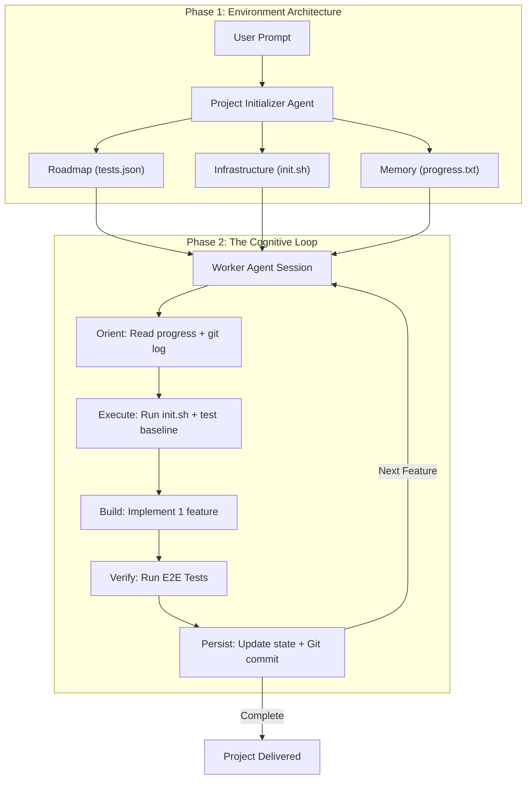

# Claude AI Agents Collection

A comprehensive library of **35 specialized AI agent role definitions** for modern software development studios. This collection is optimized for **Claude 4.x (Sonnet/Opus 4.5)** and implements the latest industry best practices for **"Long-Running Agents"**.

## 🧠 Philosophy: Why Build Agents Like This?

Standard AI agents often fail on complex tasks because they try to "one-shot" the entire problem. As tasks grow in complexity, they exceed the model's context window, leading to:
1. **Context Loss**: The model forgets initial requirements or architectural decisions as the conversation grows.
2. **Implementation Fatigue**: Code quality degrades as the session context becomes cluttered.
3. **Broken Handoffs**: New sessions start with no memory, forcing the agent to waste tokens and time "rediscovering" the project.

**Our Approach** solves this by treating development as a series of **atomic, stateful sessions**. We use a two-agent harness based on Anthropic's research:
- **The Initializer**: Spends its entire context window planning, scaffolding, and creating a machine-readable roadmap (`tests.json`).
- **The Worker**: Focused, incremental sessions that implement exactly one feature, verify it end-to-end, and persist the state for the next session.

## 🔄 How Long-Running Agents Work

## 📂 Agent Directory

Click an agent name to view its full role definition, capabilities, and anti-patterns.

| Engineering | Design | Product |
| :--- | :--- | :--- |
| [🏗️ Project Initializer](.claude/agents/engineering/project-initializer.md) | [🎨 Brand Guardian](.claude/agents/design/brand-guardian.md) | [📊 Sprint Prioritizer](.claude/agents/product/sprint-prioritizer.md) |
| [🤖 AI & LLM Engineer](.claude/agents/engineering/ai-engineer.md) | [🍱 UI Designer](.claude/agents/design/ui-designer.md) | [💡 Feedback Synthesizer](.claude/agents/product/feedback-synthesizer.md) |
| [🏛️ Backend Architect](.claude/agents/engineering/backend-architect.md) | [🔍 UX Researcher](.claude/agents/design/ux-researcher.md) | [📈 Trend Researcher](.claude/agents/product/trend-researcher.md) |
| [🚀 DevOps Automator](.claude/agents/engineering/devops-automator.md) | [🖼️ Visual Storyteller](.claude/agents/design/visual-storyteller.md) | |
| [💻 Frontend Developer](.claude/agents/engineering/frontend-developer.md) | [✨ Whimsy Injector](.claude/agents/design/whimsy-injector.md) | |
| [📱 Mobile App Builder](.claude/agents/engineering/mobile-app-builder.md) | | |
| [⚡ Rapid Prototyper](.claude/agents/engineering/rapid-prototyper.md) | | |

| Marketing | Operations | Testing |
| :--- | :--- | :--- |
| [✍️ Content Creator](.claude/agents/marketing/content-creator.md) | [📈 Analytics Reporter](.claude/agents/studio-operations/analytics-reporter.md) | [🧪 API Tester](.claude/agents/testing/api-tester.md) |
| [📈 Growth Hacker](.claude/agents/marketing/growth-hacker.md) | [💰 Finance Tracker](.claude/agents/studio-operations/finance-tracker.md) | [🏎️ Perf Benchmarker](.claude/agents/testing/performance-benchmarker.md) |
| [📱 ASO Specialist](.claude/agents/marketing/app-store-optimizer.md) | [🛠️ Infra Maintainer](.claude/agents/studio-operations/infrastructure-maintainer.md) | [📉 Results Analyzer](.claude/agents/testing/test-results-analyzer.md) |
| [📸 Instagram Curator](.claude/agents/marketing/instagram-curator.md) | [⚖️ Legal & Compliance](.claude/agents/studio-operations/legal-compliance-checker.md) | [🔧 Tool Evaluator](.claude/agents/testing/tool-evaluator.md) |
| [🤖 Reddit Builder](.claude/agents/marketing/reddit-community-builder.md) | [🎧 Support Responder](.claude/agents/studio-operations/support-responder.md) | [⚙️ Workflow Optimizer](.claude/agents/testing/workflow-optimizer.md) |
| [🎥 TikTok Strategist](.claude/agents/marketing/tiktok-strategist.md) | | |
| [🐦 Twitter Engager](.claude/agents/marketing/twitter-engager.md) | | |

| Project Management |
| :--- |
| [🔬 Experiment Tracker](.claude/agents/project-management/experiment-tracker.md) |
| [📦 Project Shipper](.claude/agents/project-management/project-shipper.md) |
| [🎬 Studio Producer](.claude/agents/project-management/studio-producer.md) |

## 🛠️ The Working Environment

To ensure agents work effectively across many context windows, we maintain three "Source of Truth" artifacts:

1.  **`tests.json` (The Roadmap)**: A structured JSON file containing 50-200+ micro-features. It is **immutable** (descriptions never change). Agents only update the `passes: true/false` field.
2.  **`init.sh` (The Engine)**: A shell script that automatically installs dependencies, starts dev servers, and runs baseline tests. This eliminates "setup toil" at the start of every session.
3.  **`claude-progress.txt` (The Memory)**: A freeform log where agents record *why* decisions were made, helping the next agent understand the "spirit" of the code.

## ✨ Claude 4.5 Optimizations

These agents are specifically tuned for the unique capabilities of the Claude 4.5 model family:

- **Parallel Tool Use**: Prompts encourage agents to read multiple files and run speculative searches simultaneously, significantly reducing latency.
- **Anti-Hallucination Guardrails**: System instructions mandate that agents must `read` a file before discussing its contents.
- **Frontend Aesthetic Guidance**: Includes specific protocols to avoid "AI Slop" by enforcing unique typography, cohesive color palettes, and staggered micro-interactions.
- **Context Awareness**: Agents are trained to monitor their token budget and save state proactively before a refresh.

---

**Built for modern software development studios** • **MIT Licensed** • **Claude 4.5 Optimized**
